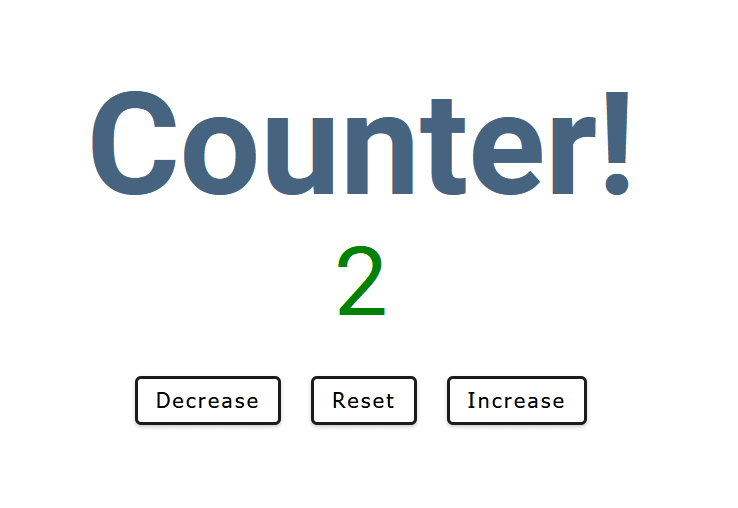
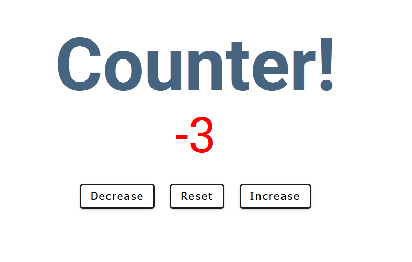

# JS_Counter
A counter made in Vanilla JavaScript! Based on the tutorial by John Smilga(https://www.youtube.com/watch?v=3PHXvlpOkf4). I wanted to follow this tutorial to learn more about Javascript, HTML, CSS and how to create functional applications using them together. 

# Functionality
- A counter with the ability to increment up and down by 1 and also reset to 0 at the any point in time
- changes the color of the current number to red when the number is negative and green when the number is positive. The colour of 0 remains at black. 

# Picture of App

